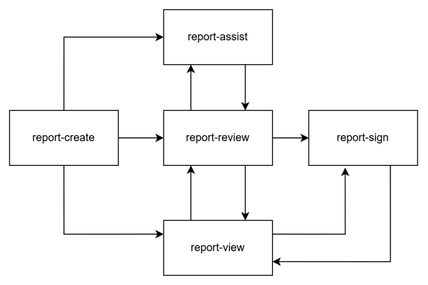

# `report-review`

| Metadata | Value
| ---- | ----
| specificationVersion | 2.0
| hookVersion | 0.1.0
| Hook maturity | [0 - Draft](../../specification/current/#hook-maturity-model)

## Workflow

The `report-review` hook fires when a provider is finished with the contents of the diagnostic report and wants it to be reviewed or augmented by another application.  For example, this hook may be called to create a report summary or impression from a completed detailed report. This hook occurs right before the report is promoted out of `preliminary` status if this is a new report, that is, before the report is signed. This hook will also occur right before the report is promoted from `final` status to `amended` status when a provider wants to add an amendment. This hook will also occur right before a report maintains `amended` status when a provider wants to add more than one amendment.

This proposal groups clinical workflows together for different departments until it is demonstrated that there are sufficiently different requirements to warrant splitting into separate hooks. For example, different departments include radiology, cardiology, laboratory, pathology, etc. However, this will require that additional parameters be defined in the prefetch of the CDS service.

The category code in the context data of this hook in [Context](#Context) identifies the department.

For example, in radiology, when a radiologist has completed the findings in a study and all sections of the report prior to the impressions, this hook will be triggered. This hook could cause a large language model (LLM) to review all sections of the report and generate the impressions of the study. This would then be available for the radiologist to review prior to signing the report.

This hook shall not be used when a report is created, to call clinical decision support, or to sign a report.
  

<br>Figure 1: Proposed Reporting CDS Hooks Workflow. The above image shows the workflow order for when the reporting CDS Hooks would be triggered.

## Context

Field | Optionality | Prefetch Token | Type | Description
----- | -------- | ---- | ---- | ----
`userId` | REQUIRED | Yes | *string* | The FHIR ID of the current user. <br>NOTE: For this hook, the user is expected to be of type [Practitioner](https://www.hl7.org/fhir/practitioner.html) or [PractitionerRole](https://www.hl7.org/fhir/practitionerrole.html). For example, Practitioner/123 or PractitionerRole/abc.
`patientId` | REQUIRED | Yes | *string* | The FHIR `Patient.id` of the current patient in context.
`encounterId` | OPTIONAL | Yes | *string* | The FHIR `Encounter.id` of the current encounter in context.
`reportId` | REQUIRED | Yes | *string* | The FHIR `DiagnosticReport.id` of the current report.
`category` | REQUIRED | No | *string* | The FHIR `DiagnosticReport.category` of the study. <br>NOTE: For example, radiology would have the category `RAD`, pathology `PAT`, and laboratory `LAB`.
`status` | REQUIRED | No | *string* | The FHIR `DiagnosticReport.status` of the report or report. <br>NOTE: For the category of radiology, the status codes `preliminary`, `final`, and `amended` are preferred. `Preliminary` would occur if the report is being reviewed before the first time it has been signed as a new report. `Final` would occur if a first amendment is being added to a report. `Amended` would occur if more than one amendments have been added to a report.
`procedure` | OPTIONAL | No | *array* | The FHIR `DiagnosticReport.code` of this study, which refers to the procedure name.  <br>NOTE: For example, the procedure code, or set of procedure codes, that correspond to an imaging study are reported as LOINC codes.

## Examples
### Example (R4, R5, R6)

```json
"context": {
  "userId": "Practitioner/123",
  "patientId": "1288992",
  "encounterId": "89284",
  "reportId": "102",
  "category": [
    {
      "coding": [
        {
           "system": "http://terminology.hl7.org/CodeSystem/v2-0074",
           "code": "RAD"
        }
      ]
    }
  ],
  "status": "preliminary",
  "procedure": {
      "coding": [
        {
           "system": "https://loinc.org",
           "code": "24627-2",
        }
      ],
   "text": "CT Chest"
  }
}
```

## Change Log

Version | Description
---- | ----
1.0 | Initial Release