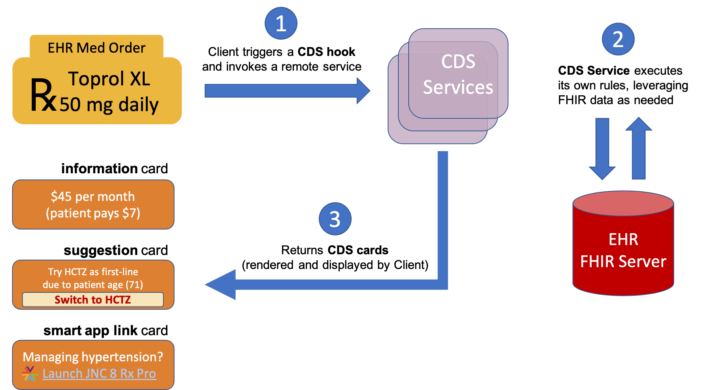

# Overview

This specification describes a
["hook"](http://en.wikipedia.org/wiki/Hooking)-based pattern for invoking
decision support from within a clinician's workflow. The API supports:

 * Synchronous, workflow-triggered CDS calls returning information and suggestions
 * Launching a user-facing SMART app when CDS requires additional interaction

## How it works

User activity inside the clinician's workflow triggers **CDS hooks** in real-time.  For example:

* `patient-view` when opening a new patient record
* `medication-prescribe` on authoring a new prescription
* `order-review` on viewing pending orders for approval

When a triggering activity occurs, the CDS Client notifies each CDS service registered for the activity. These services must then provide near-real-time feedback about the triggering event. Each service gets basic details about the clinical workflow 
context (via the `context` parameter of the hook) plus whatever
service-specific data are required (via the `pre-fetch-template` parameter).

## CDS Cards

Each CDS service can return any number of **cards** in response to the hook.
Cards convey some combination of text (*information card*), alternative
suggestions (*suggestion card*), and links to apps or reference
materials (*app link card*). A user sees these cards — one or more of each type
— embedded in the workflow, and can interact with them as follows:

* *information card*: provides text for the user to read.

* *suggestion card*: provides a specific suggestion for which the CDS Client renders a button that the user can click to accept. Clicking automatically populates the suggested change into the clinician's UI.

* *app link card*: provides a link to an app (often a SMART app) where the user can supply details, step through a flowchart, or do anything else required to help reach an informed decision.

## Try it!

You can try CDS Hooks in our Sandbox at [http://sandbox.cds-hooks.org](http://sandbox.cds-hooks.org)

An [OpenAPI Specification](https://www.openapis.org/) (formally known as the Swagger Specification) interface of CDS Hooks is available. Using the CDS Hooks OpenAPI specification, you can generate client or server code to help you get started with your implementation. You can download the [API specification](https://github.com/cds-hooks/api) and view it online via the [Swagger Editor](http://editor.swagger.io/?url=https://raw.githubusercontent.com/cds-hooks/api/master/cds-hooks.yaml).

CDS Hooks implementers are not required to use the OpenAPI Specification interface of CDS Hooks.
