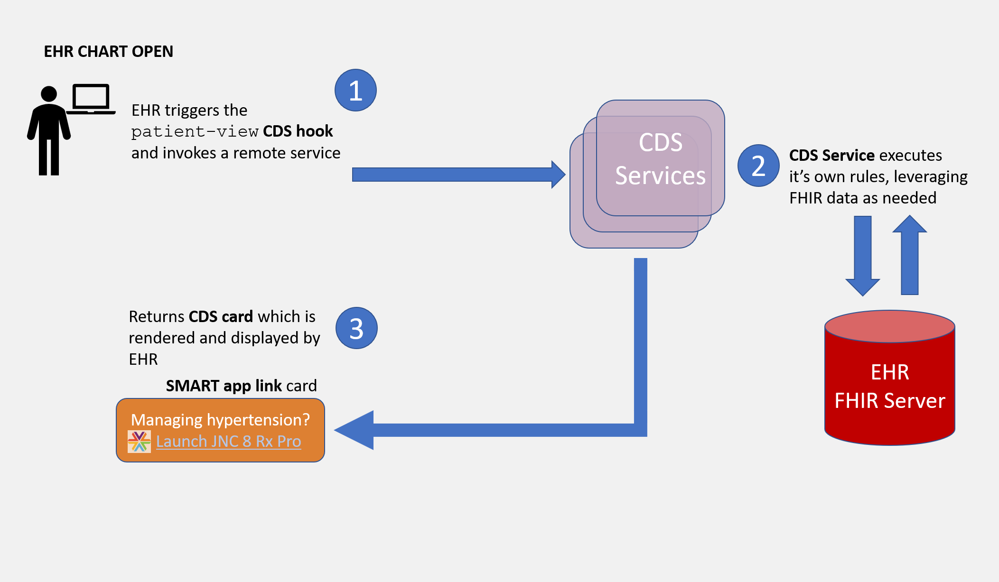

# Quick Start
This quick start tutorial defines each of the actors and provides details for implementing the `patient-view` hook. 

A CDS Hooks scenario typically includes two main actors: an CDS Client and a CDS Service, where the CDS Client may be an EHR, CPOE or other clinical workflow system. Below is an example interaction for the `patient-view` hook.



## Building a CDS Service
A CDS Service is an external service that responds to CDS Client requests through cards. A card can optionally link to a SMART app. There are several steps to setting up a CDS Service: 

1. Create an endpoint for discovery
2. Develop a service
3. Test the service with the [sandbox](http://sandbox.cds-hooks.org/)
4. If applicable, create a SMART app (or [borrow one](https://apps.smarthealthit.org/apps/pricing/open-source))
5. Test the service (and, if applicable, SMART app) with an CDS Client

This tutorial recommends implementing the CDS Hooks [security model](https://cds-hooks.hl7.org/1.0/#security-and-safety) after successful open access testing.

### Endpoint for discovery
The CDS Service must provide a stable endpoint for the CDS Client to discover the available services. A system must expose their services at `{baseUrl}/cds-services`. A service endpoint that supports the `patient-view` hook may return:

```json
{
  "services": [
    {
      "hook": "patient-view",
      "name": "Static CDS Service Example",
      "description": "An example of a CDS Service that returns a card with SMART app recommendations.",
      "id": "static-patient-view",
      "prefetch": {
        "patientToGreet": "Patient/{{context.patientId}}"
      }
    }
  ]
}
```

The attributes available to describe a CDS Services is documented in the [CDS Hooks specification](https://cds-hooks.hl7.org/1.0/#discovery).
 
### Develop a service
With a stable open end point available it's time to complete development of a service. A CDS Service could provide **information**, a **suggestion**, or a **SMART app** link. The focus of the Argonaut CDS Hooks effort is a `patient-view` hook launching a SMART app so this guide will focus on the SMART app link.

A CDS `patient-view` hook could return the following card:

```json
{
  "cards": [
    {
      "summary": "SMART App Success Card",
      "indicator": "success",
      "detail": "This is an example SMART App success card.",
      "source": {
        "label": "Static CDS Service Example",
        "url": "https://example.com"
      },
      "links": [
        {
          "label": "SMART Example App",
          "url": "https://smart.example.com/launch",
          "type": "smart"
        }
      ]
    }
  ]
 }
```


### Create a SMART App
You may already have created a SMART app prior to this step, but just in case this is a reminder. The SMART app is launched from the link returned in your service. If you want to borrow a SMART app, check out the [app gallery](https://apps.smarthealthit.org/apps/pricing/open-source).

### Test service with a sandbox
The CDS Hooks community provides a publicly available [sandbox](http://sandbox.cds-hooks.org/) to test your service. 

Select the configure hooks:<br>


Delete the existing hooks, and then do a quick add with a reference to your CDS Service:<br>


After testing with the sandbox, you are ready to connect with an CDS Client.

## Integrating CDS Services into a CDS Client
Build out following sections:

1. Call discovery endpoint 
2. Invoke service on patient-view 
3. Support FHIR resource on CDS requests (context or pre-fetch)
4. Expose non-secured FHIR server for testing
5. Render card
6. Launch SMART app 
7. Test with external CDS Service

This tutorial recommends implementing the CDS Hooks [security model](https://cds-hooks.hl7.org/1.0/#security-and-safety) after successful open access testing.

### Call discovery endpoint 
The CDS discovery endpoint provides the list of services a CDS provider supports, and the hooks a service should be invoked on. A CDS Client may configure their system to support a set of hooks at a certain location in their users work flow, or build a dynamic capability to interact with a CDS Service provider within a work flow. For the best end-user experience, this guide recommends a business analyst configure which hooks a CDS Client will support. 

Below is an example work flow where a business analyst accesses this list of available services by calling 

`GET https://example.com/cds-services` 

and then configures them in the system. 


This image captures a business analyst reviewing services from one CDS provider. A business analyst may review services from multiple providers and configure appropriate services per user profiles.

### Invoke service on patient-view hook
The `patient-view` hook is invoked when a patient chart is opened. It's one of the most basic since the logic doesn't have any prior workflow dependencies. The service called on the `patient-view` hook could be dependent on patient characteristics, for example: sex, problems in problems list, active medications, etc. The current version of the CDS Hooks specification allows the CDS Client to decide which characteristics to consider. 

### Support FHIR resource on CDS requests (context or pre-fetch)
Often a CDS Service will require additional information from the CDS Client to perform the decision support logic, or determine the appropriate SMART app to return. Prefetch provides the CDS Client the capability to pass a resource when invoking a service. For example, with a patient resource included a service could do a geography search for potential environmental risk factors. Below is an example request invoked on patient-view with a patient included: 

```json
{
   "hookInstance" : "23f1a303-991f-4118-86c5-11d99a39222e",
   "fhirServer" : "https://fhir.example.org",
   "hook" : "patient-view",
   "context" : {
     "patientId" : "1288992",
     "userId" : "Practitioner/example"
    },
   "prefetch" : {
      "patientToGreet" : {
        "resourceType" : "Patient",
        "gender" : "male",
        "birthDate" : "1925-12-23",
        "id" : "1288992",
        "active" : true
      }
   }
}
```


In some cases, additional information beyond what is included in the prefetch may be required. The CDS Service can request additional information using the FHIR REST APIs:

`GET [base]/AllergyIntolerance?patient=[id]`

It is recommended FHIR servers implement, and CDS Services follow, locale specific implementation guides. In the US, the recommended implementation guides to follow are the [Argonaut Data Query Guide (DSTU2)](http://www.fhir.org/guides/argonaut/r2/) and [HL7 US Core (STU3 and R4)](http://hl7.org/fhir/us/core/index.html). Each profile page within these implementation guides includes queries FHIR servers are required to support. 

### Expose non-secured FHIR server for testing
A non-secured FHIR server is important to support testing with a CDS Service. When the CDS Client moves a hook to production the system is expected to follow the guidelines in the [security](https://cds-hooks.hl7.org/1.0/#security-and-safety) requirements.

### Render card
The CDS Service will provide a response in the form a of a 'card'. Your CDS Client needs to be able to display the card.

Example card JSON: 

```json
{
  "summary": "Bilirubin: Based on the age of this patient consider overlaying bilirubin [Mass/volume] results over a time-based risk chart",
  "indicator": "info",
  "detail": "The focus of this app is to reduce the incidence of severe hyperbilirubinemia and bilirubin encephalopathy while minimizing the risks of unintended harm such as maternal anxiety, decreased breastfeeding, and unnecessary costs or treatment.",
  "source": {
    "label": "Intermountain",
    "url": null
  },
  "links": [
    {
      "label": "Bilirubin SMART app",
      "url": "https://example.com/launch",
      "type": "smart"
   }
  ]
}
```

Example card rendered: 


### Launch SMART app 

For some CDS Services the end step will just display the card. For the patient-view hook discussed here, we are focused on launching a SMART app. The CDS Hooks guide places no additional constraints for launching a SMART app beyond those from [SMART on FHIR](http://hl7.org/fhir/smart-app-launch/1.0.0/).

## Test with external CDS Service

No development is complete without testing with a CDS Service provider. Find a member in the [community](/community) and test away. 
