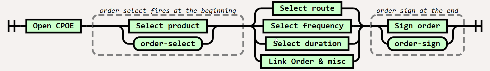

## Overview

ISAAC TO ADD DETAIL

## Active Hooks

ISAAC TO ADD DETAIL

### `allergyintolerance-create`

| Metadata | Value |
| ---- | ---- |
| specificationVersion | 1.0 |
| hookVersion | 0.1.0 |
| hookMaturity | 1 - Submitted |
{:.grid}

#### Workflow

The `allergyintolerance-create` hook fires when when a clinician adds a new allergy or intolerance to a patient's list of allergies. 
This hook fires during the act of finalizing the entry of a new allergy, such that the decision support returned from the CDS Service can guide the clinician to cancel the addition of the allergy. The context of the hook include the AllergyIntolerance resource that's about to be added to the patient's list of allergies. 

#### Context

Field | Optionality | Prefetch Token | Type | Description
----- | -------- | ---- | ---- | ----
`userId` | REQUIRED | Yes | *string* | The id of the current user.<br />For this hook, the user is expected to be of type [Practitioner](https://www.hl7.org/fhir/practitioner.html).<br />For example, `Practitioner/123`
`patientId` | REQUIRED | Yes | *string* |  The FHIR `Patient.id` of the current patient in context
`encounterId` | OPTIONAL | Yes | *string* |  The FHIR `Encounter.id` of the current encounter in context
`allergyIntolerance` | REQUIRED | No | *object* | R4/STU3/DSTU2 - FHIR AllergyIntolerance instance


#### Example

##### Example (R4)

```json
{
  "context": {
    "userId": "Practitioner/123",
    "patientId": "1288992",
    "encounterId": "89284",
    "allergyIntolerance": {
      "resource": {
        "resourceType": "AllergyIntolerance",
        "id": "RES163672",
        "clinicalStatus": "active",
        "verificationStatus": "confirmed",
        "type": "allergy",
        "category": [
          "food"
        ],
        "criticality": "high",
        "code": {
          "coding": [
            {
              "system": "http://snomed.info/sct",
              "code": "424213003",
              "display": "Allergy to bee venom"
            }
          ]
        },
        "patient": {
          "reference": "Patient/1288992"
        },
        "assertedDate": "2018-11-15T07:05:57-05:00"
      }
    }
  }
}
```


##### Example (STU3)

```json
{
  "context": {
    "userId": "Practitioner/123",
    "patientId": "1288992",
    "encounterId": "89284",
    "allergyIntolerances": {
      "resourceType": "Bundle",
      "entry": [
        {
          "resource": {
            "resourceType": "AllergyIntolerance",
            "id": "RES163672",
            "clinicalStatus": "active",
            "verificationStatus": "confirmed",
            "type": "allergy",
            "category": [
              "food"
            ],
            "criticality": "high",
            "code": {
              "coding": [
                {
                  "system": "http://snomed.info/sct",
                  "code": "424213003",
                  "display": "Allergy to bee venom"
                }
              ]
            },
            "patient": {
              "reference": "Patient/1288992"
            },
            "assertedDate": "2018-11-15T07:05:57-05:00"
          }
        }
      ]
    }
  }
}
```

##### Example (DSTU2)
 
```json
{
  "context": {
    "userId": "Practitioner/123",
    "patientId": "1288992",
    "encounterId": "89284",
    "allergyIntolerances": {
      "resourceType": "Bundle",
      "entry": [
        {
          "resource": {
            "resourceType": "AllergyIntolerance",
            "id": "RES443610",
            "recordedDate": "1992-05-28T17:22:05-04:00",
            "patient": {
              "reference": "Patient/1288992"
            },
            "substance": {
              "coding": [
                {
                  "system": "http://snomed.info/sct",
                  "code": "424213003",
                  "display": "Allergy to bee venom"
                }
              ]
            },
            "status": "active",
            "criticality": "low",
            "type": "allergy",
            "category": "food"
          }
        }
      ]
    }
  }
}
```

#### Change Log

Version | Description
---- | ----
0.1.0 | Initial Release

### `appointment-book`

!!! info "Looking for Feedback"
    **Hey implementers, we want to hear from you!**<br/>
    - What obstacles are there to limiting this hook to firing only when the appointment is  confirmed or finalized as booked? <br/>
    - For which users should this hook fire?<br/>
    - Many appointments are scheduled directly into the EHR by the patient, without provider staff involvement ...

| Metadata | Value
| ---- | ----
| specificationVersion | 1.0
| hookVersion | 1.0
| hookMaturity | [1 - Submitted](../../specification/current/#hook-maturity-model)

#### Workflow

This hook is invoked when the user is scheduling one or more future encounters/visits for the patient.  For example, the `appointment-book` hook may be triggered for an appointment with the appointment creator, a clinician within the same organization as the appointment creator or even for an appointment outside the creator's organization.  It may be invoked at the start and end of the booking process and/or any time between those two points.  This hook enables CDS Services to intervene in the decision of when future appointments should be scheduled, where they should be scheduled, what services should be booked, to identify actions that need to occur prior to scheduled appointments, etc.  

#### Context

The Patient whose appointment(s) are being booked, as well as the proposed Appointment records.

Field | Optionality | Prefetch Token | Type | Description
----- | -------- | ---- | ---- | ----
`userId` | REQUIRED | Yes | *string* | The id of the current user.<br />For this hook, the user could be of type [Practitioner](https://www.hl7.org/fhir/practitioner.html), [PractitionerRole](https://www.hl7.org/fhir/practitionerrole.html), [Patient](https://www.hl7.org/fhir/patient.html), or [RelatedPerson](https://www.hl7.org/fhir/relatedperson.html).<br />For example, `PractitionerRole/123`. Patient or RelatedPerson are appropriate when a patient or their proxy are booking the appointment. 
`patientId` | REQUIRED | Yes | *string* | The FHIR `Patient.id` of Patient appointment(s) is/are for
`encounterId` | OPTIONAL | Yes | *string* | The FHIR `Encounter.id` of Encounter where booking was initiated
`appointments` | REQUIRED | No | *object* | DSTU2/STU3/R4 - FHIR Bundle of Appointments in 'proposed' state


#### Examples

##### Examples (STU3)

```json
"context":{
  "userId" : "PractitionerRole/A2340113",
  "patientId" : "1288992",
  "appointments" : [
    {
      "resourceType": "Appointment",
      "id": "apt1",
      "status": "proposed",
      "serviceType": [
        {
          "coding": [
            {
              "code": "183",
              "display": "Sleep Medicine"
            }
          ]
        }
      ],
      "appointmentType": {
        "coding": [
          {
            "system": "http://hl7.org/fhir/v2/0276",
            "code": "FOLLOWUP",
            "display": "A follow up visit from a previous appointment"
          }
        ]
      },
      "reason": {
        "coding": {
          "system": "",
          "code": "1023001",
          "display": "Apnea"
        }
      },
      "description": "CPAP adjustments",
      "start": "2019-08-10T09:00:00-06:00",
      "end": "2019-08-10T09:10:00:00-06:00",
      "created": "2019-08-01",
      "participant": [
        {
          "actor": {
            "reference": "Patient/example",
            "display": "Peter James Chalmers"
          },
          "required": "required",
          "status": "tentative"
        },
        {
          "actor": {
            "reference": "Practitioner/example",
            "display": "Dr Adam Careful"
          },
          "required": "required",
          "status": "accepted"
        }
      ]
    },
    {
      "resourceType": "Appointment",
      "id": "apt1",
      "status": "proposed",
      "appointmentType": {
        "coding": [
          {
            "system": "http://hl7.org/fhir/v2/0276",
            "code": "CHECKUP",
            "display": "A routine check-up, such as an annual physical"
          }
        ]
      },
      "description": "Regular physical",
      "start": "2020-08-01T13:00:00-06:00",
      "end": "2020-08-01T13:30:00:00-06:00",
      "created": "2019-08-01",
      "participant": [
        {
          "actor": {
            "reference": "Patient/example",
            "display": "Peter James Chalmers"
          },
          "required": "required",
          "status": "tentative"
        },
        {
          "actor": {
            "reference": "Practitioner/example",
            "display": "Dr Adam Careful"
          },
          "required": "required",
          "status": "accepted"
        }
      ]
    }
  ]
}
```

```json 
"context":{
  "userId" : "PractitionerRole/A2340113",
  "patientId" : "1288992",
  "encounterId" : "456",
  "appointments" : [
    {
      "resourceType": "Appointment",
      "id": "example",
      "text": {
        "status": "generated",
        "div": "<div xmlns=\"http://www.w3.org/1999/xhtml\">Brian MRI results discussion</div>"
      },
      "status": "proposed",
      "serviceCategory": {
        "coding": [
          {
            "system": "http://example.org/service-category",
            "code": "gp",
            "display": "General Practice"
          }
        ]
      },
      "serviceType": [
        {
          "coding": [
            {
              "code": "52",
              "display": "General Discussion"
            }
          ]
        }
      ],
      "specialty": [
        {
          "coding": [
            {
              "system": "http://example.org/specialty",
              "code": "gp",
              "display": "General Practice"
            }
          ]
        }
      ],
      "appointmentType": {
        "coding": [
          {
            "system": "http://example.org/appointment-type",
            "code": "follow",
            "display": "Followup"
          }
        ]
      },
      "indication": [
        {
          "reference": "Condition/example",
          "display": "Severe burn of left ear"
        }
      ],
      "priority": 5,
      "description": "Discussion on the results of your recent MRI",
      "start": "2013-12-10T09:00:00Z",
      "end": "2013-12-10T11:00:00Z",
      "created": "2013-10-10",
      "comment": "Further expand on the results of the MRI and determine the next actions that may be appropriate.",
      "incomingReferral": [
        {
          "reference": "ReferralRequest/example"
        }
      ],
      "participant": [
        {
          "actor": {
            "reference": "Patient/example",
            "display": "Peter James Chalmers"
          },
          "required": "required",
          "status": "tentative"
        },
        {
          "type": [
            {
              "coding": [
                {
                  "system": "http://hl7.org/fhir/v3/ParticipationType",
                  "code": "ATND"
                }
              ]
            }
          ],
          "actor": {
            "reference": "Practitioner/example",
            "display": "Dr Adam Careful"
          },
          "required": "required",
          "status": "accepted"
        },
        {
          "actor": {
            "reference": "Location/1",
            "display": "South Wing, second floor"
          },
          "required": "required",
          "status": "action-needed"
        }
      ]
    }
  ]
}
```

#### Change Log

Version | Description
---- | ----
1.0 | Initial Release

### `encounter-discharge`

| Metadata | Value
| ---- | ----
| specificationVersion | 1.0
| hookVersion | 1.0
| hookMaturity | [1 - Submitted](../../specification/current/#hook-maturity-model)

#### Workflow

This hook is invoked when the user is performing the discharge process for an encounter where the notion of 'discharge' is relevant - typically an inpatient encounter.  It may be invoked at the start and end of the discharge process or any time between those two points.  It allows hook services to intervene in the decision of whether discharge is appropriate, to verify discharge medications, to check for continuity of care planning, to ensure necessary documentation is present for discharge processing, etc.

#### Context

The patient who is being discharged and the encounter being ended.

Field | Optionality | Prefetch Token | Type | Description
----- | -------- | ---- | ---- | ----
`userId` | REQUIRED | Yes | *string* | The id of the current user.<br />For this hook, the user is expected to be of type [Practitioner](https://www.hl7.org/fhir/practitioner.html) or [PractitionerRole](https://www.hl7.org/fhir/practitionerrole.html).<br />For example, `Practitioner/123`
`patientId` | REQUIRED | Yes | *string* | The FHIR `Patient.id` of the being discharged
`encounterId` | REQUIRED | Yes | *string* | The FHIR `Encounter.id` of the Encounter being ended

#### Examples

```json
"context":{
  "userId" : "PractitionerRole/A2340113",
  "patientId" : "1288992",
  "encounterId" : "456"
}
```

#### Change Log

Version | Description
---- | ----
1.0 | Initial Release

### `encounter-start`

!!! info "Looking for Feedback"
    **Hey implementers, we want to hear from you!**<br/>
    - What's the greatest opportunity for delivering remote CDS at the start of an encounter?<br/>
    - For which users should this hook fire?<br/>
    - When in a hospitalization workflow, an ambulatory workflow, does an encounter start?<br/>
    - How many and what types of encounters are there in a single hospitalization, a single ambulatory visit?<br/>
    - Is there value in an encounter start hook pairing with an (typically inpatient) encounter discharge hook?<br/> 
    - Please explain your encounter workflow.<br/>

| Metadata | Value
| ---- | ----
| specificationVersion | 1.0
| hookVersion | 1.0
| hookMaturity | 1 - Submitted

#### Workflow

This hook is invoked when the user is initiating a new encounter.  In an inpatient setting, this would be the time of admission.  In an outpatient/community environment, this would be the time of patient-check-in for a face-to-face or equivalent for a virtual/telephone encounter.  The Encounter should either be in one of the following states: `planned` | `arrived` | `triaged` | `in-progress`.  Note that there can be multiple 'starts' for the same encounter as each user becomes engaged.  For example, when a scheduled encounter is presented at the beginning of the day for planning purposes, when the patient arrives, when the patient first encounters a clinician, etc.  Hooks may present different information depending on user role and Encounter.status.

Note: This is distinct from the `patient-view` hook which occurs any time the patient's record is looked at - which might be done outside the context of any encounter and will often occur during workflows that are not linked to the initiation of an encounter.

The intention is that the cards from any invoked CDS Services are available at the time when decisions are being made about what actions are going to occur during this encounter.  For example, identifying that the patient is due for certain diagnostic tests or interventions, identifying additional information that should be collected to comply with protocols associated with clinical studies the patient is enrolled in, identifying any documentation or other requirements associated with patient insurance, etc.

#### Context

Field | Optionality | Prefetch Token | Type | Description
----- | -------- | ---- | ---- | ----
`userId` | REQUIRED | Yes | *string* | The id of the current user.<br />For this hook, the user is expected to be of type [Practitioner](https://www.hl7.org/fhir/practitioner.html) or [PractitionerRole](https://www.hl7.org/fhir/practitionerrole.html).<br />For example, `PractitionerRole/123`
`patientId` | REQUIRED | Yes | *string* | The FHIR `Patient.id` of the Patient the Encounter is for
`encounterId` | REQUIRED | Yes | *string* | The FHIR `Encounter.id` of the Encounter being started

#### Examples

```json
"context":{
  "userId" : "PractitionerRole/A2340113",
  "patientId" : "1288992",
  "encounterId" : "456"
}
```

#### Change Log

Version | Description
---- | ----
1.0 | Initial Release

### `medication-refill`

| Metadata | Value
| ---- | ----
| specificationVersion | 2.0
| hookVersion | 0.1.0
| hookMaturity | [1 - Submitted](../../specification/current/#hook-maturity-model)

#### Workflow

The `medication-refill` hook fires when a medication refill request for an existing prescription of a specific medication is received. A refill request may be made as part of an encounter or out-of-band through a pharmacy or patient portal. Since a prescription refill is requested outside of the prescriber's workflow, there often is not a user in context. Similarly, the encounter may be an auto-generated refill encounter or there may not be an encounter in context when the refill request is received.  A CDS service may use this hook to deliver medication refill protocol guidance to a clinician. Given the asynchronous workflow of refill requests, the guidance returned by the service may be viewed immediately, or not.

This hook does not fire for an initial prescription (see order-sign). "Re-prescribing" or replacing a previously active prescription with a new perscription for the same medication does not fire the medication-refill.

#### Context

The set of medications in the process of being refilled. All FHIR resources in this context MUST be based on the same FHIR version. All FHIR resources in the medications object MUST have a status of _draft_.

Field | Optionality | Prefetch Token | Type | Description
----- | -------- | ---- | ---- | ----
`userId` | OPTIONAL | Yes | *string* | In the case when this field is empty, consider the FHIR resource's requestor and recorder elements. <br />The id of the current user entering the refill request within the CPOE. For this hook, the user is expected to be of type Practitioner or PractitionerRole. For example, PractitionerRole/123 or Practitioner/abc.
`patientId` | REQUIRED | Yes | *string* |  The FHIR `Patient.id` of the current patient in context
`encounterId` | OPTIONAL | Yes | *string* |  The FHIR `Encounter.id` of the encounter associated with the refill of the prescription. 
`medications` | REQUIRED | No | *object* | R4 - FHIR Bundle of _draft_, _order_ MedicationRequest resources

#### Examples

##### Example (R4)

```json
{
   "context":{
      "userId":"Practitioner/123",
      "patientId":"1288992",
      "encounterId":"89284",
      "medications":{
         "resourceType":"Bundle",
         "entry":[
            {
               "resource":{
                  "resourceType":"MedicationRequest",
                  "id":"smart-MedicationRequest-104",
                  "status":"draft",
                  "intent":"order",
                  "medicationReference": {
                     "reference": "Medication/eFnx9hyX.YTNJ407PR9g4zpiT8lXCElOXkldLgGDYrAU-fszvYmrUZlYzRfJl-qKj3",
                     "display": "oxybutynin (DITROPAN XL) CR tablet"
                  },
                  "subject":{
                     "reference":"Patient/1288992"
                  },
                  "dosageInstruction":[
                     {
                        "text":"15 mL daily x 3 days",
                        "timing":{
                           "repeat":{
                              "boundsPeriod":{
                                 "start":"2005-01-18"
                              },
                              "frequency":1,
                              "period":1,
                              "periodUnit":"d"
                           }
                        },
                        "doseQuantity":{
                           "value":15,
                           "unit":"mL",
                           "system":"http://unitsofmeasure.org",
                           "code":"mL"
                        }
                     }
                  ],
                  "dispenseRequest":{
                     "numberOfRepeatsAllowed":1,
                     "quantity":{
                        "value":1,
                        "unit":"mL",
                        "system":"http://unitsofmeasure.org",
                        "code":"mL"
                     },
                     "expectedSupplyDuration":{
                        "value":3,
                        "unit":"days",
                        "system":"http://unitsofmeasure.org",
                        "code":"d"
                     }
                  }
               }
            }
         ]
      }
   }
}
```

##### Example (DSTU2)

```json 
{
   "context":{
      "userId":"Practitioner/123",
      "patientId":"1288992",
      "encounterId":"89284",
      "medications":{
         "resourceType":"Bundle",
         "entry":[
            {
               "resource":{
                  "resourceType":"MedicationOrder",
                  "id":"smart-MedicationOrder-104",
                  "status":"draft",
                  "patient":{
                     "reference":"Patient/1288992"
                  },
                  "medicationCodeableConcept":{
                     "coding":[
                        {
                           "system":"http://www.nlm.nih.gov/research/umls/rxnorm",
                           "code":"211307",
                           "display":"Azithromycin 20 MG/ML Oral Suspension [Zithromax]"
                        }
                     ],
                     "text":"Azithromycin 20 MG/ML Oral Suspension [Zithromax]"
                  },
                  "dosageInstruction":[
                     {
                        "text":"15 mL daily x 3 days",
                        "timing":{
                           "repeat":{
                              "boundsPeriod":{
                                 "start":"2005-01-18"
                              },
                              "frequency":1,
                              "period":1,
                              "periodUnits":"d"
                           }
                        },
                        "doseQuantity":{
                           "value":15,
                           "unit":"mL",
                           "system":"http://unitsofmeasure.org",
                           "code":"mL"
                        }
                     }
                  ],
                  "dispenseRequest":{
                     "numberOfRepeatsAllowed":1,
                     "quantity":{
                        "value":1,
                        "unit":"mL",
                        "system":"http://unitsofmeasure.org",
                        "code":"mL"
                     },
                     "expectedSupplyDuration":{
                        "value":3,
                        "unit":"days",
                        "system":"http://unitsofmeasure.org",
                        "code":"d"
                     }
                  }
               }
            }
         ]
      }
   }
}
```

#### Change Log

Version | Description
---- | ----
0.1.0 | Initial Release 

### `order-dispatch`

| Metadata | Value
| ---- | ----
| specificationVersion | 2.0
| hookVersion | 1.1
| hookMaturity | [0 - Draft](../../specification/current/#hook-maturity-model)

#### Workflow

The `order-dispatch` hook fires when a practitioner is selecting a candidate performer for a pre-existing order or (set of orders) that was not assigned to a specific performer.  For example, selecting an imaging center to satisfy a radiology order, selecting a cardiologist to satisfy a referral, etc.  This hook only occurs in situations where the order is agnostic as to who the performer should be and a separate process (which might be performed by back-office staff, a central dispatch service, or even the ordering clincian themselves at a later time) is used to select and seek action by a specific performer.  It is possible that the same order might be dispatched multiple times, either because initial selected targets refuse or are otherwise unable to satisfy the order, or because the performer is only asked to perform a 'portion' of what's authorized (the first monthly lab test of a year-long set, the first dispense of a 6 month order, etc.).  Note that the order isn't updated to include the performer in this situation, as the authorization of who could theoretically perform the order isn't changed by seeking fulfillment by a specific provider.

This "request for fulfillment" process is typically represented in FHIR using [Task](http://hl7.org/fhir/task.html).  This resource allows identifying the order to be acted upon, who is being asked to act on it, the time-period in which they're expected to act, and any limitations/qualifications to 'how much' of the order should be acted on.

Decision support that may be relevant for this hook might include information related to coverage, prior-authorization and/or in-network/out-of-network evaluations with respect to the chosen performer; determination of practitioner availability or qualification; enforcement/guidance with respect to patient performer preferences; etc.

#### Context

Field | Optionality | Prefetch Token | Type | Description
----- | -------- | ---- | ---- | ----
`patientId` | REQUIRED | Yes | *string* |  The FHIR `Patient.id` of the current patient in context
`dispatchedOrders` | REQUIRED | Yes | *array* |  Collection of the FHIR local references for the Request resource(s) for which fulfillment is sought  E.g. `ServiceRequest/123`
`performer` | REQUIRED | Yes | *string* |  The FHIR local reference for the Practitioner, PractitionerRole, Organization, CareTeam, etc. who is being asked to execute the order.  E.g. `Practitioner/456`
`fulfillmentTasks` | OPTIONAL | No | *array* | DSTU2/STU3/R4/R5 - Collection of the Task instances (as objects) that provides a full description of the fulfillment request - including the timing and any constraints on fulfillment.  If Tasks are provided, each will be for a separate order and SHALL reference one of the dispatched-orders.

#### Examples
##### Example (R4)

```json
"context":{
  "patientId" : "1288992",
  "dispatched-orders" : ["ServiceRequest/proc002"],
  "performer" : "Organization/some-performer",
  "fulfillment-tasks" : [{
    "resourceType" : "Task",
    "status" : "draft",
    "intent" : "order",
    "code" : {
      "coding" : [{
        "system" : "http://hl7.org/fhir/CodeSystem/task-code",
        "code" : "fulfill"
      }]
    },
    "focus" : {
      "reference" : "ServiceRequest/proc002"
    },
    "for" : {
      "reference" : "Patient/1288992"
    },
    "authoredOn" : "2016-03-10T22:39:32-04:00",
    "lastModified" : "2016-03-10T22:39:32-04:00",
    "requester": {
      "reference" : "Practitioner/456"
    },
    "owner" : {
      "reference" : "Organziation/some-performer"
    }
  }]
}
```

#### Change Log

Version | Description
---- | ----
1.0 | Initial Release
1.1 | Adjusted context names and cardinalities based on feedback

### `order-select`

| Metadata | Value
| ---- | ----
| specificationVersion | 1.0
| hookVersion | 1.0
| Hook maturity | [4 - Documented](../../specification/current/#hook-maturity-model)

#### Workflow

The order-select hook occurs after the clinician selects the order and before signing.

This hook occurs when a clinician initially selects one or more new orders from a list of potential orders for a specific patient (including orders for medications, procedures, labs and other orders). The newly selected order defines that medication, procedure, lab, etc, but may or may not define the additional details necessary to finalize the order.

`order-select` is among the first workflow events for an order entering a draft status. The context of this hook may include defaulted order details upon the clinician selecting the order from the order catalogue of the CPOE, or upon her manual selection of order details (e.g. dose, quantity, route, etc). CDS services should expect some of the order information to not yet be specified. Additionally, the context may include previously selected orders that are not yet signed from the same ordering session. 

This hook is intended to replace (deprecate) the medication-prescribe hook.



#### Context

Decision support should focus on the 'selected' orders - those that are newly selected or currently being authored.  The non-selected orders are included in the context to provide context and to allow decision support to take into account other pending actions that might not yet be stored in the system (and therefore not queryable).
The context of this hook distinguishes between the list of unsigned orders from the clinician's ordering session, and the one or more orders just added to this list. The `selections` field contains a list of ids of these newly selected orders; the `draftOrders` Bundle contains an entry for all unsigned orders from this session, including newly selected orders.

Field | Optionality | Prefetch Token | Type | Description
----- | -------- | ---- | ---- | ----
`userId` | REQUIRED | Yes | *string* | The id of the current user.<br />For this hook, the user is expected to be of type [Practitioner](https://www.hl7.org/fhir/practitioner.html) or [PractitionerRole](https://www.hl7.org/fhir/practitionerrole.html).<br />For example, `PractitionerRole/123` or `Practitioner/abc`.
`patientId` | REQUIRED | Yes | *string* |  The FHIR `Patient.id` of the current patient in context
`encounterId` | OPTIONAL | Yes | *string* |  The FHIR `Encounter.id` of the current encounter in context
`selections` | REQUIRED | No| *array* | The FHIR id of the newly selected order(s).<br />The `selections` field references FHIR resources in the `draftOrders` Bundle. For example, `MedicationRequest/103`.
`draftOrders` | REQUIRED | No | *object* | A Bundle of FHIR request resources with a draft status, representing orders that aren't yet signed from the current ordering session. 

#### A Note Concerning FHIR Versions

CDS Hooks is designed to be agnostic of FHIR version. For example, all versions of FHIR can represent in-progress orders but over time, the specific resource name and some of the important elements have changed.  Below are some of the mosty commonly used FHIR resources for representing an order in CDS Hooks. This list is intentionally not comprehensive. 
* DSTU2 - FHIR Bundle of MedicationOrder, ProcedureRequest
* STU3 - FHIR Bundle of MedicationRequest, ProcedureRequest
* R4 - FHIR Bundle of MedicationRequest, ServiceRequest

#### Examples

##### Example (R4)

```json
{
   "context":{
      "userId":"PractitionerRole/123",
      "patientId":"1288992",
      "encounterId":"89284",
      "selections": [ "NutritionOrder/pureeddiet-simple", "MedicationRequest/smart-MedicationRequest-103" ],
      "draftOrders":{
         "resourceType":"Bundle",
         "entry":[
            {
               "resource":{
                  "resourceType":"NutritionOrder",
                  "id":"pureeddiet-simple",
                  "identifier":[
                     {
                        "system":"http://goodhealthhospital.org/nutrition-requests",
                        "value":"123"
                     }
                  ],
                  "status":"draft",
                  "patient":{
                     "reference":"Patient/1288992"
                  },
                  "dateTime":"2014-09-17",
                  "orderer":{
                     "reference":"Practitioner/example",
                     "display":"Dr Adam Careful"
                  },
                  "oralDiet":{
                     "type":[
                        {
                           "coding":[
                              {
                                 "system":"http://snomed.info/sct",
                                 "code":"226211001",
                                 "display":"Pureed diet"
                              },
                              {
                                 "system":"http://goodhealthhospital.org/diet-type-codes",
                                 "code":"1010",
                                 "display":"Pureed diet"
                              }
                           ],
                           "text":"Pureed diet"
                        }
                     ],
                     "schedule":[
                        {
                           "repeat":{
                              "boundsPeriod":{
                                 "start":"2015-02-10"
                              },
                              "frequency":3,
                              "period":1,
                              "periodUnit":"d"
                           }
                        }
                     ],
                     "texture":[
                        {
                           "modifier":{
                              "coding":[
                                 {
                                    "system":"http://snomed.info/sct",
                                    "code":"228055009",
                                    "display":"Liquidized food"
                                 }
                              ],
                              "text":"Pureed"
                           }
                        }
                     ],
                     "fluidConsistencyType":[
                        {
                           "coding":[
                              {
                                 "system":"http://snomed.info/sct",
                                 "code":"439021000124105",
                                 "display":"Dietary liquid consistency - nectar thick liquid"
                              }
                           ],
                           "text":"Nectar thick liquids"
                        }
                     ]
                  },
                  "supplement":[
                     {
                        "type":{
                           "coding":[
                              {
                                 "system":"http://snomed.info/sct",
                                 "code":"442971000124100",
                                 "display":"Adult high energy formula"
                              },
                              {
                                 "system":"http://goodhealthhospital.org/supplement-type-codes",
                                 "code":"1040",
                                 "display":"Adult high energy pudding"
                              }
                           ],
                           "text":"Adult high energy pudding"
                        },
                        "productName":"Ensure Pudding 4 oz container",
                        "instruction":"Ensure Pudding at breakfast, lunch, supper"
                     }
                  ]
               }
            },
            {
               "resource":{
                  "resourceType":"MedicationRequest",
                  "id":"smart-MedicationRequest-103",
                  "meta":{
                     "lastUpdated":"2018-04-30T13:25:40.845-04:00"
                  },
                  "text":{
                     "status":"generated",
                     "div":"<div xmlns=\"http://www.w3.org/1999/xhtml\">Amoxicillin 120 MG/ML / clavulanate potassium 8.58 MG/ML Oral Suspension (rxnorm: 617993)</div>"
                  },
                  "status":"draft",
                  "intent":"order",
                  "medicationCodeableConcept":{
                     "coding":[
                        {
                           "system":"http://www.nlm.nih.gov/research/umls/rxnorm",
                           "code":"617993",
                           "display":"Amoxicillin 120 MG/ML / clavulanate potassium 8.58 MG/ML Oral Suspension"
                        }
                     ],
                     "text":"Amoxicillin 120 MG/ML / clavulanate potassium 8.58 MG/ML Oral Suspension"
                  },
                  "subject":{
                     "reference":"Patient/1288992"
                  },
                  "dosageInstruction":[
                     {
                        "text":"5 mL bid x 10 days",
                        "timing":{
                           "repeat":{
                              "boundsPeriod":{
                                 "start":"2005-01-04"
                              },
                              "frequency":2,
                              "period":1,
                              "periodUnit":"d"
                           }
                        },
                        "doseAndRate":{
                           "doseQuantity":{
                              "value":5,
                              "unit":"mL",
                              "system":"http://unitsofmeasure.org",
                              "code":"mL"
                           }
                        }
                     }
                  ],
                  "dispenseRequest":{
                     "numberOfRepeatsAllowed":1,
                     "quantity":{
                        "value":1,
                        "unit":"mL",
                        "system":"http://unitsofmeasure.org",
                        "code":"mL"
                     },
                     "expectedSupplyDuration":{
                        "value":10,
                        "unit":"days",
                        "system":"http://unitsofmeasure.org",
                        "code":"d"
                     }
                  }
               }
            }
         ]
      }
   }
}
```

##### Example (STU3)

```json
{
   "context":{
      "userId":"Practitioner/example",
      "patientId":"1288992",
      "encounterId":"89284",
      "selections": [ "NutritionOrder/pureeddiet-simple", "MedicationRequest/smart-MedicationRequest-103" ],
      "draftOrders":{
         "resourceType":"Bundle",
         "entry":[
            {
               "resource":{
                  "resourceType":"NutritionOrder",
                  "id":"pureeddiet-simple",
                  "identifier":[
                     {
                        "system":"http://goodhealthhospital.org/nutrition-requests",
                        "value":"123"
                     }
                  ],
                  "status":"draft",
                  "patient":{
                     "reference":"Patient/1288992"
                  },
                  "dateTime":"2014-09-17",
                  "orderer":{
                     "reference":"Practitioner/example",
                     "display":"Dr Adam Careful"
                  },
                  "oralDiet":{
                     "type":[
                        {
                           "coding":[
                              {
                                 "system":"http://snomed.info/sct",
                                 "code":"226211001",
                                 "display":"Pureed diet"
                              },
                              {
                                 "system":"http://goodhealthhospital.org/diet-type-codes",
                                 "code":"1010",
                                 "display":"Pureed diet"
                              }
                           ],
                           "text":"Pureed diet"
                        }
                     ],
                     "schedule":[
                        {
                           "repeat":{
                              "boundsPeriod":{
                                 "start":"2015-02-10"
                              },
                              "frequency":3,
                              "period":1,
                              "periodUnit":"d"
                           }
                        }
                     ],
                     "texture":[
                        {
                           "modifier":{
                              "coding":[
                                 {
                                    "system":"http://snomed.info/sct",
                                    "code":"228055009",
                                    "display":"Liquidized food"
                                 }
                              ],
                              "text":"Pureed"
                           }
                        }
                     ],
                     "fluidConsistencyType":[
                        {
                           "coding":[
                              {
                                 "system":"http://snomed.info/sct",
                                 "code":"439021000124105",
                                 "display":"Dietary liquid consistency - nectar thick liquid"
                              }
                           ],
                           "text":"Nectar thick liquids"
                        }
                     ]
                  },
                  "supplement":[
                     {
                        "type":{
                           "coding":[
                              {
                                 "system":"http://snomed.info/sct",
                                 "code":"442971000124100",
                                 "display":"Adult high energy formula"
                              },
                              {
                                 "system":"http://goodhealthhospital.org/supplement-type-codes",
                                 "code":"1040",
                                 "display":"Adult high energy pudding"
                              }
                           ],
                           "text":"Adult high energy pudding"
                        },
                        "productName":"Ensure Pudding 4 oz container",
                        "instruction":"Ensure Pudding at breakfast, lunch, supper"
                     }
                  ]
               }
            },
            {
               "resource":{
                  "resourceType":"MedicationRequest",
                  "id":"smart-MedicationRequest-103",
                  "meta":{
                     "lastUpdated":"2018-04-30T13:25:40.845-04:00"
                  },
                  "text":{
                     "status":"generated",
                     "div":"<div xmlns=\"http://www.w3.org/1999/xhtml\">Amoxicillin 120 MG/ML / clavulanate potassium 8.58 MG/ML Oral Suspension (rxnorm: 617993)</div>"
                  },
                  "status":"draft",
                  "intent":"order",
                  "medicationCodeableConcept":{
                     "coding":[
                        {
                           "system":"http://www.nlm.nih.gov/research/umls/rxnorm",
                           "code":"617993",
                           "display":"Amoxicillin 120 MG/ML / clavulanate potassium 8.58 MG/ML Oral Suspension"
                        }
                     ],
                     "text":"Amoxicillin 120 MG/ML / clavulanate potassium 8.58 MG/ML Oral Suspension"
                  },
                  "subject":{
                     "reference":"Patient/1288992"
                  },
                  "dosageInstruction":[
                     {
                        "text":"5 mL bid x 10 days",
                        "timing":{
                           "repeat":{
                              "boundsPeriod":{
                                 "start":"2005-01-04"
                              },
                              "frequency":2,
                              "period":1,
                              "periodUnit":"d"
                           }
                        },
                        "doseQuantity":{
                           "value":5,
                           "unit":"mL",
                           "system":"http://unitsofmeasure.org",
                           "code":"mL"
                        }
                     }
                  ],
                  "dispenseRequest":{
                     "numberOfRepeatsAllowed":1,
                     "quantity":{
                        "value":1,
                        "unit":"mL",
                        "system":"http://unitsofmeasure.org",
                        "code":"mL"
                     },
                     "expectedSupplyDuration":{
                        "value":10,
                        "unit":"days",
                        "system":"http://unitsofmeasure.org",
                        "code":"d"
                     }
                  }
               }
            }
         ]
      }
   }
}
```

##### Example (DSTU2)

```json
"context":{
  "userId":"Practitioner/example",
  "patientId":"1288992",
  "encounterId":"89284",
  "selections":[ "NutritionOrder/nest-patient-1-NUTR1", "MedicationOrder/smart-MedicationOrder-103" ],
  "draftOrders":{
    "resourceType":"Bundle",
    "entry":[
      {
        "resource":{
          "resourceType":"NutritionOrder",
          "id":"nest-patient-1-NUTR1",
          "patient":{
            "reference":"Patient/1288992"
          },
          "orderer":{
            "display":"Dr Adam Careful"
          },
          "identifier":[
            {
              "system":"http://goodhealthhospital.org/nutrition-orders",
              "value":"123"
            }
          ],
          "dateTime":"2014-09-17",
          "status":"draft",
          "oralDiet":{
            "type":[
              {
                "coding":[
                  {
                    "system":"http://snomed.info/sct",
                    "code":"435801000124108",
                    "display":"Texture modified diet"
                  },
                  {
                    "system":"http://goodhealthhospital.org/diet-type-codes",
                    "code":"1010",
                    "display":"Texture modified diet"
                  }
                ],
                "text":"Texture modified diet"
              }
            ],
            "schedule":[
              {
                "repeat":{
                  "boundsPeriod":{
                    "start":"2015-02-10"
                  },
                  "frequency":3,
                  "period":1,
                  "periodUnits":"d"
                }
              }
            ],
            "texture":[
              {
                "modifier":{
                  "coding":[
                    {
                      "system":"http://snomed.info/sct",
                      "code":"228049004",
                      "display":"Chopped food"
                    }
                  ],
                  "text":"Regular, Chopped Meat"
                },
                "foodType":{
                  "coding":[
                    {
                      "system":"http://snomed.info/sct",
                      "code":"22836000",
                      "display":"Vegetable"
                    }
                  ],
                  "text":"Regular, Chopped Meat"
                }
              }
            ]
          }
        }
      },
      {
        "resource":{
          "resourceType":"MedicationOrder",
          "id":"smart-MedicationOrder-103",
          "status":"draft",
          "patient":{
            "reference":"Patient/1288992"
          },
          "medicationCodeableConcept":{
            "coding":[
              {
                "system":"http://www.nlm.nih.gov/research/umls/rxnorm",
                "code":"617993",
                "display":"Amoxicillin 120 MG/ML / clavulanate potassium 8.58 MG/ML Oral Suspension"
              }
            ],
            "text":"Amoxicillin 120 MG/ML / clavulanate potassium 8.58 MG/ML Oral Suspension"
          },
          "dosageInstruction":[
            {
              "text":"5 mL bid x 10 days",
              "timing":{
                "repeat":{
                  "boundsPeriod":{
                    "start":"2005-01-04"
                  },
                  "frequency":2,
                  "period":1,
                  "periodUnits":"d"
                }
              },
              "doseQuantity":{
                "value":5,
                "unit":"mL",
                "system":"http://unitsofmeasure.org",
                "code":"mL"
              }
            }
          ],
          "dispenseRequest":{
            "numberOfRepeatsAllowed":1,
            "quantity":{
              "value":1,
              "unit":"mL",
              "system":"http://unitsofmeasure.org",
              "code":"mL"
            },
            "expectedSupplyDuration":{
              "value":10,
              "unit":"days",
              "system":"http://unitsofmeasure.org",
              "code":"d"
            }
          }
        }
      }
    ]
  }
}
```

#### Change Log

Version | Description
---- | ----
1.0 | Initial Release
1.0.1 | Small documentation correction
1.0.2 | Add DeviceRequest to list of order resources for R4.

### `order-sign`

| Metadata | Value
| ---- | ----
| specificationVersion | 1.0
| hookVersion | 1.0
| Hook maturity | [5 - Mature](../../specification/current/#hook-maturity-model)

#### Workflow

The `order-sign` hook fires when a clinician is ready to sign one or more orders for a patient, (including orders for medications, procedures, labs and other orders).
This hook is among the last workflow events before an order is promoted out of a draft status. 
The context contains all order details, such as dose, quantity, route, etc, 
although the order has not yet been signed and therefore still exists in a draft status. 
Use this hook when your service requires all order details.

This hook can also be used when an order or set of orders is being 're-signed' after revision (e.g. change
to status, extending dates, or other changes allowed to signed orders within the system's workflow).  In this
case, the orders would typically have a status other than 'draft'.  In some cases, the hook might fire with a
mixture of new and revised orders.

This hook is intended to replace (deprecate) the `medication-prescribe` and `order-review` hooks. 


#### Context

Field | Optionality | Prefetch Token | Type | Description
----- | -------- | ---- | ---- | ----
`userId` | REQUIRED | Yes | *string* | The id of the current user.<br />For this hook, the user is expected to be of type [Practitioner](https://www.hl7.org/fhir/practitioner.html) or [PractitionerRole](https://www.hl7.org/fhir/practitionerrole.html).<br />For example, `PractitionerRole/123` or `Practitioner/abc`.
`patientId` | REQUIRED | Yes | *string* |  The FHIR `Patient.id` of the current patient in context
`encounterId` | OPTIONAL | Yes | *string* |  The FHIR `Encounter.id` of the current encounter in context
`draftOrders` | REQUIRED | No | *object* | A Bundle of FHIR request resources with a draft status, representing orders that aren't yet signed from the current ordering session. 

#### A Note Concerning FHIR Versions

CDS Hooks is designed to be agnostic of FHIR version. For example, all versions of FHIR can represent in-progress orders but over time, the specific resource name and some of the important elements have changed.  Below are some of the mosty commonly used FHIR resources for representing an order in CDS Hooks. This list is intentionally not comprehensive. 
* DSTU2 - FHIR Bundle of MedicationOrder, ProcedureRequest
* STU3 - FHIR Bundle of MedicationRequest, ProcedureRequest
* R4 - FHIR Bundle of MedicationRequest, ServiceRequest

#### Examples

##### Example (R4)

```json
{
   "context":{
      "userId":"PractitionerRole/123",
      "patientId":"1288992",
      "encounterId":"89284",
      "draftOrders":{
         "resourceType":"Bundle",
         "entry":[
            {
               "resource":{
                  "resourceType":"NutritionOrder",
                  "id":"pureeddiet-simple",
                  "identifier":[
                     {
                        "system":"http://goodhealthhospital.org/nutrition-requests",
                        "value":"123"
                     }
                  ],
                  "status":"draft",
                  "patient":{
                     "reference":"Patient/1288992"
                  },
                  "dateTime":"2014-09-17",
                  "orderer":{
                     "reference":"Practitioner/example",
                     "display":"Dr Adam Careful"
                  },
                  "oralDiet":{
                     "type":[
                        {
                           "coding":[
                              {
                                 "system":"http://snomed.info/sct",
                                 "code":"226211001",
                                 "display":"Pureed diet"
                              },
                              {
                                 "system":"http://goodhealthhospital.org/diet-type-codes",
                                 "code":"1010",
                                 "display":"Pureed diet"
                              }
                           ],
                           "text":"Pureed diet"
                        }
                     ],
                     "schedule":[
                        {
                           "repeat":{
                              "boundsPeriod":{
                                 "start":"2015-02-10"
                              },
                              "frequency":3,
                              "period":1,
                              "periodUnit":"d"
                           }
                        }
                     ],
                     "texture":[
                        {
                           "modifier":{
                              "coding":[
                                 {
                                    "system":"http://snomed.info/sct",
                                    "code":"228055009",
                                    "display":"Liquidized food"
                                 }
                              ],
                              "text":"Pureed"
                           }
                        }
                     ],
                     "fluidConsistencyType":[
                        {
                           "coding":[
                              {
                                 "system":"http://snomed.info/sct",
                                 "code":"439021000124105",
                                 "display":"Dietary liquid consistency - nectar thick liquid"
                              }
                           ],
                           "text":"Nectar thick liquids"
                        }
                     ]
                  },
                  "supplement":[
                     {
                        "type":{
                           "coding":[
                              {
                                 "system":"http://snomed.info/sct",
                                 "code":"442971000124100",
                                 "display":"Adult high energy formula"
                              },
                              {
                                 "system":"http://goodhealthhospital.org/supplement-type-codes",
                                 "code":"1040",
                                 "display":"Adult high energy pudding"
                              }
                           ],
                           "text":"Adult high energy pudding"
                        },
                        "productName":"Ensure Pudding 4 oz container",
                        "instruction":"Ensure Pudding at breakfast, lunch, supper"
                     }
                  ]
               }
            },
            {
               "resource":{
                  "resourceType":"MedicationRequest",
                  "id":"smart-MedicationRequest-103",
                  "meta":{
                     "lastUpdated":"2018-04-30T13:25:40.845-04:00"
                  },
                  "text":{
                     "status":"generated",
                     "div":"<div xmlns=\"http://www.w3.org/1999/xhtml\">Amoxicillin 120 MG/ML / clavulanate potassium 8.58 MG/ML Oral Suspension (rxnorm: 617993)</div>"
                  },
                  "status":"draft",
                  "intent":"order",
                  "medicationCodeableConcept":{
                     "coding":[
                        {
                           "system":"http://www.nlm.nih.gov/research/umls/rxnorm",
                           "code":"617993",
                           "display":"Amoxicillin 120 MG/ML / clavulanate potassium 8.58 MG/ML Oral Suspension"
                        }
                     ],
                     "text":"Amoxicillin 120 MG/ML / clavulanate potassium 8.58 MG/ML Oral Suspension"
                  },
                  "subject":{
                     "reference":"Patient/1288992"
                  },
                  "dosageInstruction":[
                     {
                        "text":"5 mL bid x 10 days",
                        "timing":{
                           "repeat":{
                              "boundsPeriod":{
                                 "start":"2005-01-04"
                              },
                              "frequency":2,
                              "period":1,
                              "periodUnit":"d"
                           }
                        },
                        "doseQuantity":{
                           "value":5,
                           "unit":"mL",
                           "system":"http://unitsofmeasure.org",
                           "code":"mL"
                        }
                     }
                  ],
                  "dispenseRequest":{
                     "numberOfRepeatsAllowed":1,
                     "quantity":{
                        "value":1,
                        "unit":"mL",
                        "system":"http://unitsofmeasure.org",
                        "code":"mL"
                     },
                     "expectedSupplyDuration":{
                        "value":10,
                        "unit":"days",
                        "system":"http://unitsofmeasure.org",
                        "code":"d"
                     }
                  }
               }
            }
         ]
      }
   }
}
```

##### Example (STU3)

```json
{
   "context":{
      "userId":"Practitioner/example",
      "patientId":"1288992",
      "encounterId":"89284",
      "draftOrders":{
         "resourceType":"Bundle",
         "entry":[
            {
               "resource":{
                  "resourceType":"NutritionOrder",
                  "id":"pureeddiet-simple",
                  "identifier":[
                     {
                        "system":"http://goodhealthhospital.org/nutrition-requests",
                        "value":"123"
                     }
                  ],
                  "status":"draft",
                  "patient":{
                     "reference":"Patient/1288992"
                  },
                  "dateTime":"2014-09-17",
                  "orderer":{
                     "reference":"Practitioner/example",
                     "display":"Dr Adam Careful"
                  },
                  "oralDiet":{
                     "type":[
                        {
                           "coding":[
                              {
                                 "system":"http://snomed.info/sct",
                                 "code":"226211001",
                                 "display":"Pureed diet"
                              },
                              {
                                 "system":"http://goodhealthhospital.org/diet-type-codes",
                                 "code":"1010",
                                 "display":"Pureed diet"
                              }
                           ],
                           "text":"Pureed diet"
                        }
                     ],
                     "schedule":[
                        {
                           "repeat":{
                              "boundsPeriod":{
                                 "start":"2015-02-10"
                              },
                              "frequency":3,
                              "period":1,
                              "periodUnit":"d"
                           }
                        }
                     ],
                     "texture":[
                        {
                           "modifier":{
                              "coding":[
                                 {
                                    "system":"http://snomed.info/sct",
                                    "code":"228055009",
                                    "display":"Liquidized food"
                                 }
                              ],
                              "text":"Pureed"
                           }
                        }
                     ],
                     "fluidConsistencyType":[
                        {
                           "coding":[
                              {
                                 "system":"http://snomed.info/sct",
                                 "code":"439021000124105",
                                 "display":"Dietary liquid consistency - nectar thick liquid"
                              }
                           ],
                           "text":"Nectar thick liquids"
                        }
                     ]
                  },
                  "supplement":[
                     {
                        "type":{
                           "coding":[
                              {
                                 "system":"http://snomed.info/sct",
                                 "code":"442971000124100",
                                 "display":"Adult high energy formula"
                              },
                              {
                                 "system":"http://goodhealthhospital.org/supplement-type-codes",
                                 "code":"1040",
                                 "display":"Adult high energy pudding"
                              }
                           ],
                           "text":"Adult high energy pudding"
                        },
                        "productName":"Ensure Pudding 4 oz container",
                        "instruction":"Ensure Pudding at breakfast, lunch, supper"
                     }
                  ]
               }
            },
            {
               "resource":{
                  "resourceType":"MedicationRequest",
                  "id":"smart-MedicationRequest-103",
                  "meta":{
                     "lastUpdated":"2018-04-30T13:25:40.845-04:00"
                  },
                  "text":{
                     "status":"generated",
                     "div":"<div xmlns=\"http://www.w3.org/1999/xhtml\">Amoxicillin 120 MG/ML / clavulanate potassium 8.58 MG/ML Oral Suspension (rxnorm: 617993)</div>"
                  },
                  "status":"draft",
                  "intent":"order",
                  "medicationCodeableConcept":{
                     "coding":[
                        {
                           "system":"http://www.nlm.nih.gov/research/umls/rxnorm",
                           "code":"617993",
                           "display":"Amoxicillin 120 MG/ML / clavulanate potassium 8.58 MG/ML Oral Suspension"
                        }
                     ],
                     "text":"Amoxicillin 120 MG/ML / clavulanate potassium 8.58 MG/ML Oral Suspension"
                  },
                  "subject":{
                     "reference":"Patient/1288992"
                  },
                  "dosageInstruction":[
                     {
                        "text":"5 mL bid x 10 days",
                        "timing":{
                           "repeat":{
                              "boundsPeriod":{
                                 "start":"2005-01-04"
                              },
                              "frequency":2,
                              "period":1,
                              "periodUnit":"d"
                           }
                        },
                        "doseAndRate":{
                           "doseQuantity":{
                              "value":5,
                              "unit":"mL",
                              "system":"http://unitsofmeasure.org",
                              "code":"mL"
                           }
                        }
                     }
                  ],
                  "dispenseRequest":{
                     "numberOfRepeatsAllowed":1,
                     "quantity":{
                        "value":1,
                        "unit":"mL",
                        "system":"http://unitsofmeasure.org",
                        "code":"mL"
                     },
                     "expectedSupplyDuration":{
                        "value":10,
                        "unit":"days",
                        "system":"http://unitsofmeasure.org",
                        "code":"d"
                     }
                  }
               }
            }
         ]
      }
   }
}
```

##### Example (DSTU2)

```json
"context":{
  "userId":"Practitioner/abc",
  "patientId":"1288992",
  "encounterId":"89284",
  "draftOrders":{
    "resourceType":"Bundle",
    "entry":[
      {
        "resource":{
          "resourceType":"NutritionOrder",
          "id":"nest-patient-1-NUTR1",
          "patient":{
            "reference":"Patient/1288992"
          },
          "orderer":{
            "display":"Dr Adam Careful"
          },
          "identifier":[
            {
              "system":"http://goodhealthhospital.org/nutrition-orders",
              "value":"123"
            }
          ],
          "dateTime":"2014-09-17",
          "status":"draft",
          "oralDiet":{
            "type":[
              {
                "coding":[
                  {
                    "system":"http://snomed.info/sct",
                    "code":"435801000124108",
                    "display":"Texture modified diet"
                  },
                  {
                    "system":"http://goodhealthhospital.org/diet-type-codes",
                    "code":"1010",
                    "display":"Texture modified diet"
                  }
                ],
                "text":"Texture modified diet"
              }
            ],
            "schedule":[
              {
                "repeat":{
                  "boundsPeriod":{
                    "start":"2015-02-10"
                  },
                  "frequency":3,
                  "period":1,
                  "periodUnits":"d"
                }
              }
            ],
            "texture":[
              {
                "modifier":{
                  "coding":[
                    {
                      "system":"http://snomed.info/sct",
                      "code":"228049004",
                      "display":"Chopped food"
                    }
                  ],
                  "text":"Regular, Chopped Meat"
                },
                "foodType":{
                  "coding":[
                    {
                      "system":"http://snomed.info/sct",
                      "code":"22836000",
                      "display":"Vegetable"
                    }
                  ],
                  "text":"Regular, Chopped Meat"
                }
              }
            ]
          }
        }
      },
      {
        "resource":{
          "resourceType":"MedicationOrder",
          "id":"smart-MedicationOrder-103",
          "status":"draft",
          "patient":{
            "reference":"Patient/1288992"
          },
          "medicationCodeableConcept":{
            "coding":[
              {
                "system":"http://www.nlm.nih.gov/research/umls/rxnorm",
                "code":"617993",
                "display":"Amoxicillin 120 MG/ML / clavulanate potassium 8.58 MG/ML Oral Suspension"
              }
            ],
            "text":"Amoxicillin 120 MG/ML / clavulanate potassium 8.58 MG/ML Oral Suspension"
          },
          "dosageInstruction":[
            {
              "text":"5 mL bid x 10 days",
              "timing":{
                "repeat":{
                  "boundsPeriod":{
                    "start":"2005-01-04"
                  },
                  "frequency":2,
                  "period":1,
                  "periodUnits":"d"
                }
              },
              "doseQuantity":{
                "value":5,
                "unit":"mL",
                "system":"http://unitsofmeasure.org",
                "code":"mL"
              }
            }
          ],
          "dispenseRequest":{
            "numberOfRepeatsAllowed":1,
            "quantity":{
              "value":1,
              "unit":"mL",
              "system":"http://unitsofmeasure.org",
              "code":"mL"
            },
            "expectedSupplyDuration":{
              "value":10,
              "unit":"days",
              "system":"http://unitsofmeasure.org",
              "code":"d"
            }
          }
        }
      }
    ]
  }
}
```

#### Change Log

Version | Description
---- | ----
1.0 | Initial Release
1.0.1 | Add DeviceRequest to list of order resources for R4.
1.1.0 | Updated hook to all for use in order-revision situations

### `patient-view`

!!! info
    This page defines a workflow [hook](../../specification/current/#hooks) for the purpose of providing clinical decision support using CDS Hooks. This is a **build** at the level of **[Trial Use](http://hl7.org/fhir/versions.html#std-processs)**.

| Metadata | Value
| ---- | ----
| specificationVersion | 1.0
| hookVersion | 1.0
| hookMaturity | [5 - Mature](../../specification/1.0/#hook-maturity-model)

#### Workflow

The user has just opened a patient's record; typically called only once at the beginning of a user's interaction with a specific patient's record.

#### Context

The patient whose record was opened, including their encounter, if applicable.

Field | Optionality | Prefetch Token | Type | Description
----- | -------- | ---- | ---- | ----
`userId` | REQUIRED | Yes | *string* | The id of the current user.  Must be in the format `[ResourceType]/[id]`.<br />For this hook, the user is expected to be of type [Practitioner](https://www.hl7.org/fhir/practitioner.html), [PractitionerRole](https://www.hl7.org/fhir/practitionerrole.html), [Patient](https://www.hl7.org/fhir/patient.html), or [RelatedPerson](https://www.hl7.org/fhir/relatedperson.html).<br /> Patient or RelatedPerson are appropriate when a patient or their proxy are viewing the record.<br />For example, Practitioner/abc or Patient/123.
`patientId` | REQUIRED | Yes | *string* | The FHIR `Patient.id` of the current patient in context
`encounterId` | OPTIONAL | Yes | *string* | The FHIR `Encounter.id` of the current encounter in context

#### Examples

```json
"context":{
  "userId" : "PractitionerRole/123",
  "patientId" : "1288992"
}
```

```json
"context":{
  "userId" : "Practitioner/abc",
  "patientId" : "1288992",
  "encounterId" : "456"
}
```

#### Change Log

Version | Description
---- | ----
1.0 | Initial Release

### `problem-list-item-create`

| Metadata | Value
| ---- | ----
| specificationVersion | 1.0
| hookVersion | 0.1.0
| hookMaturity | [1 - Submitted](../../specification/current/#hook-maturity-model)

#### Workflow

The `problem-list-item-create` hook fires once a clinician has added one or more new problems to a patient's problem list. 
This hook may fire with one or more newly added conditions of category `problem-list-item` that are newly finalized. 
The context of the hook includes these new conditions. Note that this hook occurs once the new problem(s) is finalized; thereby enabling the CDS Service to recommend actions related to the problem in lieu of suggesting modifications to the newly created problem. 

#### Context

Field | Optionality | Prefetch Token | Type | Description
----- | -------- | ---- | ---- | ----
`userId` | REQUIRED | Yes | *string* | The id of the current user.<br />For this hook, the user is expected to be of type [Practitioner](https://www.hl7.org/fhir/practitioner.html) or [PractitionerRole](https://www.hl7.org/fhir/practitioner.html).<br />For example, PractitionerRole/123 or Practitioner/abc.
`patientId` | REQUIRED | Yes | *string* |  The FHIR `Patient.id` of the current patient in context
`encounterId` | OPTIONAL | Yes | *string* |  The FHIR `Encounter.id` of the current encounter in context
`conditions` | REQUIRED | No | *object* | DSTU2 - FHIR Bundle of Conditions where `category` is `problem-list-item`<br/> STU3 - FHIR Bundle of Conditions where `category` is `problem-list-item`<br/> R4 - FHIR Bundle of Conditions where `category` is `problem-list-item`

#### Examples

##### Example (R4)

```json
{
  "context": {
    "userId": "Practitioner/123",
    "patientId": "1288992",
    "encounterId": "89284",
    "conditions": {
      "resourceType": "Bundle",
      "entry": [
        {
          "resource": {
            "resourceType": "Condition",
            "id": "3a14127f",
            "category": "problem-list-item",
            "clinicalStatus": {
              "coding": [
                {
                  "system": "http://terminology.hl7.org/CodeSystem/condition-clinical",
                  "code": "active"
                }
              ]
            },
            "verificationStatus": {
              "coding": [
                {
                  "system": "http://terminology.hl7.org/CodeSystem/condition-ver-status",
                  "code": "confirmed"
                }
              ]
            },
            "code": {
              "coding": [
                {
                  "system": "http://snomed.info/sct",
                  "code": "16114001",
                  "display": "Fracture of ankle"
                }
              ],
              "text": "Fracture of ankle"
            },
            "subject": {
              "reference": "Patient/1288992"
            },
            "onsetDateTime": "2018-10-15T04:13:17-04:00",
            "assertedDate": "2018-11-15"
          }
        }
      ]
    }
  }
}
```

##### Example (STU3)

```json
{
   "context":{
      "userId":"Practitioner/123",
      "patientId":"1288992",
      "encounterId":"89284",
      "conditions":{
         "resourceType":"Bundle",
         "entry":[
            {
               "resource":{
                  "resourceType":"Condition",
                  "id":"3a14127f",
                  "category":"problem-list-item",                 
                  "clinicalStatus":"active",
                  "verificationStatus":"confirmed",
                  "code":{
                     "coding":[
                        {
                           "system":"http://snomed.info/sct",
                           "code":"16114001",
                           "display":"Fracture of ankle"
                        }
                     ],
                     "text":"Fracture of ankle"
                  },
                  "subject":{
                     "reference":"Patient/1288992"
                  },
                  "onsetDateTime":"2018-10-15T04:13:17-04:00",
                  "assertedDate":"2018-11-15"
               }
            }
         ]
      }
   }
}
```

##### Example (DSTU2)

```json
{
  "context": {
    "userId": "Practitioner/123",
    "patientId": "1288992",
    "encounterId": "89284",
    "conditions": {
      "resourceType": "Bundle",
      "entry": [
        {
          "resource": {
            "resourceType": "Condition",
            "id": "smart-Condition-548",
            "category": {
              "text": "Problem",
              "coding": [
                {
                  "system": "http://argonautwiki.hl7.org/extension-codes",
                  "code": "problem",
                  "display": "Problem"
                }
              ]
            },
            "text": {
              "status": "generated",
              "div": "<div xmlns=\"http://www.w3.org/1999/xhtml\">Vitamin D deficiency</div>"
            },
            "patient": {
              "reference": "Patient/1288992"
            },
            "code": {
              "coding": [
                {
                  "system": "http://snomed.info/sct",
                  "code": "34713006",
                  "display": "Vitamin D deficiency"
                }
              ],
              "text": "Vitamin D deficiency"
            },
            "clinicalStatus": "active",
            "verificationStatus": "confirmed",
            "onsetDateTime": "2018-11-15"
          }
        }
      ]
    }
  }
}
```

#### Change Log

Version | Description
---- | ----
0.1.0 | Initial Release

## Deprecated Hooks

ISAAC TO ADD DETAIL

### `medication-prescribe`

| Metadata | Value
| ---- | ----
| specificationVersion | 1.0
| hookVersion | 1.0
| Hook maturity | [2 - Tested](../../specification/1.0/#hook-maturity-model)


#### Deprecation Notice

This hook is deprecated in favor of the `order-select` and `order-sign` hooks, with the goal of  clarifying workflow trigger points and supporting orders beyond medications. In this refactoring, `medication-prescribe` and `order-review` hooks are being deprecated in favor of newly created [`order-select`](../order-select) and [`order-sign`](../order-sign) hooks. This notice is a placeholder to this effect while CDS Hooks determines the [appropriate process for deprecating hooks](https://github.com/cds-hooks/docs/issues/433).

#### Workflow

The user is in the process of prescribing one or more new medications.

#### Context

The set of medications proposed or in progress of being prescribed. All FHIR resources in this context MUST be based on the same FHIR version. All FHIR resources in the medications object MUST have a status of _draft_.

Field | Optionality | Prefetch Token | Type | Description
----- | -------- | ---- | ---- | ----
`userId` | REQUIRED | Yes | *string* | The id of the current user.<br />For this hook, the user is expected to be of type [Practitioner](https://www.hl7.org/fhir/practitioner.html).<br />For example, `Practitioner/123`
`patientId` | REQUIRED | Yes | *string* |  The FHIR `Patient.id` of the current patient in context
`encounterId` | OPTIONAL | Yes | *string* |  The FHIR `Encounter.id` of the current encounter in context
`medications` | REQUIRED | No | *object* | DSTU2 - FHIR Bundle of _draft_ MedicationOrder resources <br/> STU3 - FHIR Bundle of _draft_ MedicationRequest resources

#### Examples

##### Example (STU3)

```json
{
  "context":{
    "userId":"Practitioner/123",
    "patientId":"1288992",
    "encounterId":"89284",
    "medications":{
      "resourceType":"Bundle",
      "entry":[
        {
          "resource":{
            "resourceType":"MedicationRequest",
            "id":"smart-MedicationRequest-103",
            "meta":{
              "lastUpdated":"2018-04-30T13:25:40.845-04:00"
            },
            "text":{
              "status":"generated",
              "div":"<div xmlns=\"http://www.w3.org/1999/xhtml\">Amoxicillin 120 MG/ML / clavulanate potassium 8.58 MG/ML Oral Suspension (rxnorm: 617993)</div>"
            },
            "status":"draft",
            "intent":"order",
            "medicationCodeableConcept":{
              "coding":[
                {
                  "system":"http://www.nlm.nih.gov/research/umls/rxnorm",
                  "code":"617993",
                  "display":"Amoxicillin 120 MG/ML / clavulanate potassium 8.58 MG/ML Oral Suspension"
                }
              ],
              "text":"Amoxicillin 120 MG/ML / clavulanate potassium 8.58 MG/ML Oral Suspension"
            },
            "subject":{
              "reference":"Patient/1288992"
            },
            "dosageInstruction":[
              {
                "text":"5 mL bid x 10 days",
                "timing":{
                  "repeat":{
                    "boundsPeriod":{
                      "start":"2005-01-04"
                    },
                    "frequency":2,
                    "period":1,
                    "periodUnit":"d"
                  }
                },
                "doseQuantity":{
                  "value":5,
                  "unit":"mL",
                  "system":"http://unitsofmeasure.org",
                  "code":"mL"
                }
              }
            ],
            "dispenseRequest":{
              "numberOfRepeatsAllowed":1,
              "quantity":{
                "value":1,
                "unit":"mL",
                "system":"http://unitsofmeasure.org",
                "code":"mL"
              },
              "expectedSupplyDuration":{
                "value":10,
                "unit":"days",
                "system":"http://unitsofmeasure.org",
                "code":"d"
              }
            }
          }
        },
        {
          "resource":{
            "resourceType":"MedicationRequest",
            "id":"smart-MedicationRequest-104",
            "meta":{
              "lastUpdated":"2018-04-30T13:26:48.124-04:00"
            },
            "text":{
              "status":"generated",
              "div":"<div xmlns=\"http://www.w3.org/1999/xhtml\">Azithromycin 20 MG/ML Oral Suspension [Zithromax] (rxnorm: 211307)</div>"
            },
            "status":"draft",
            "intent":"order",
            "medicationCodeableConcept":{
              "coding":[
                {
                  "system":"http://www.nlm.nih.gov/research/umls/rxnorm",
                  "code":"211307",
                  "display":"Azithromycin 20 MG/ML Oral Suspension [Zithromax]"
                }
              ],
              "text":"Azithromycin 20 MG/ML Oral Suspension [Zithromax]"
            },
            "subject":{
              "reference":"Patient/1288992"
            },
            "dosageInstruction":[
              {
                "text":"15 mL daily x 3 days",
                "timing":{
                  "repeat":{
                    "boundsPeriod":{
                      "start":"2005-01-18"
                    },
                    "frequency":1,
                    "period":1,
                    "periodUnit":"d"
                  }
                },
                "doseQuantity":{
                  "value":15,
                  "unit":"mL",
                  "system":"http://unitsofmeasure.org",
                  "code":"mL"
                }
              }
            ],
            "dispenseRequest":{
              "numberOfRepeatsAllowed":1,
              "quantity":{
                "value":1,
                "unit":"mL",
                "system":"http://unitsofmeasure.org",
                "code":"mL"
              },
              "expectedSupplyDuration":{
                "value":3,
                "unit":"days",
                "system":"http://unitsofmeasure.org",
                "code":"d"
              }
            }
          }
        }
      ]
    }
  }
}
```

##### Example (DSTU2)

```json 
{
  "context":{
    "userId":"Practitioner/123",
    "patientId":"1288992",
    "encounterId":"89284",
    "medications":{
      "resourceType":"Bundle",
      "entry":[
        {
          "resource":{
            "resourceType":"MedicationOrder",
            "id":"smart-MedicationOrder-103",
            "status":"draft",
            "patient":{
              "reference":"Patient/1288992"
            },
            "medicationCodeableConcept":{
              "coding":[
                {
                  "system":"http://www.nlm.nih.gov/research/umls/rxnorm",
                  "code":"617993",
                  "display":"Amoxicillin 120 MG/ML / clavulanate potassium 8.58 MG/ML Oral Suspension"
                }
              ],
              "text":"Amoxicillin 120 MG/ML / clavulanate potassium 8.58 MG/ML Oral Suspension"
            },
            "dosageInstruction":[
              {
                "text":"5 mL bid x 10 days",
                "timing":{
                  "repeat":{
                    "boundsPeriod":{
                      "start":"2005-01-04"
                    },
                    "frequency":2,
                    "period":1,
                    "periodUnits":"d"
                  }
                },
                "doseQuantity":{
                  "value":5,
                  "unit":"mL",
                  "system":"http://unitsofmeasure.org",
                  "code":"mL"
                }
              }
            ],
            "dispenseRequest":{
              "numberOfRepeatsAllowed":1,
              "quantity":{
                "value":1,
                "unit":"mL",
                "system":"http://unitsofmeasure.org",
                "code":"mL"
              },
              "expectedSupplyDuration":{
                "value":10,
                "unit":"days",
                "system":"http://unitsofmeasure.org",
                "code":"d"
              }
            }
          }
        },
        {
          "resource":{
            "resourceType":"MedicationOrder",
            "id":"smart-MedicationOrder-104",
            "status":"draft",
            "patient":{
              "reference":"Patient/1288992"
            },
            "medicationCodeableConcept":{
              "coding":[
                {
                  "system":"http://www.nlm.nih.gov/research/umls/rxnorm",
                  "code":"211307",
                  "display":"Azithromycin 20 MG/ML Oral Suspension [Zithromax]"
                }
              ],
              "text":"Azithromycin 20 MG/ML Oral Suspension [Zithromax]"
            },
            "dosageInstruction":[
              {
                "text":"15 mL daily x 3 days",
                "timing":{
                  "repeat":{
                    "boundsPeriod":{
                      "start":"2005-01-18"
                    },
                    "frequency":1,
                    "period":1,
                    "periodUnits":"d"
                  }
                },
                "doseQuantity":{
                  "value":15,
                  "unit":"mL",
                  "system":"http://unitsofmeasure.org",
                  "code":"mL"
                }
              }
            ],
            "dispenseRequest":{
              "numberOfRepeatsAllowed":1,
              "quantity":{
                "value":1,
                "unit":"mL",
                "system":"http://unitsofmeasure.org",
                "code":"mL"
              },
              "expectedSupplyDuration":{
                "value":3,
                "unit":"days",
                "system":"http://unitsofmeasure.org",
                "code":"d"
              }
            }
          }
        }
      ]
    }
  }
}
```

#### Change Log

Version | Description
---- | ----
1.0 | Initial Release

### `order-review`

| Metadata | Value
| ---- | ----
| specificationVersion | 1.0
| hookVersion | 1.0
| Hook maturity | [3 - Considered](../../specification/1.0/#hook-maturity-model)

#### Deprecation Notice

This hook is deprecated in favor of the `order-sign` hooks, with the goal of  clarifying workflow trigger points and supporting orders beyond medications. In this refactoring, `medication-prescribe` and `order-review` hooks are being deprecated in favor of newly created [`order-select`](../order-select) and [`order-sign`](../order-sign) hooks. This notice is a placeholder to this effect while CDS Hooks determines the [appropriate process for deprecating hooks](https://github.com/cds-hooks/docs/issues/433).

#### Workflow

The user is in the process of reviewing a set of orders to sign.

#### Context

The set of orders being reviewed for signature on-screen. All FHIR resources in this _context_ MUST be based on the same FHIR version. All FHIR resources in the `orders` object MUST have a status of _draft_.

Field | Optionality | Prefetch Token | Type | Description
----- | -------- | ---- | ---- | ----
`userId` | REQUIRED | Yes | *string* | The id of the current user.<br />For this hook, the user is expected to be of type [Practitioner](https://www.hl7.org/fhir/practitioner.html).<br />For example, `Practitioner/123`
`patientId` | REQUIRED | Yes | *string* | The FHIR `Patient.id` of the current patient in context
`encounterId` | OPTIONAL | Yes | *string* | The FHIR `Encounter.id` of the current encounter in context
`orders` | REQUIRED | No | *object* | DSTU2 - FHIR Bundle of MedicationOrder, DiagnosticOrder, DeviceUseRequest, ReferralRequest, ProcedureRequest, NutritionOrder, VisionPrescription with _draft_ status <br/> STU3 - FHIR Bundle of MedicationRequest, ReferralRequest, ProcedureRequest, NutritionOrder, VisionPrescription with _draft_ status

#### Examples

##### Example (STU3)

```json
{
   "context":{
      "userId":"Practitioner/123",
      "patientId":"1288992",
      "encounterId":"89284",
      "orders":{
         "resourceType":"Bundle",
         "entry":[
            {
               "resource":{
                  "resourceType":"NutritionOrder",
                  "id":"pureeddiet-simple",
                  "identifier":[
                     {
                        "system":"http://goodhealthhospital.org/nutrition-requests",
                        "value":"123"
                     }
                  ],
                  "status":"draft",
                  "patient":{
                     "reference":"Patient/1288992"
                  },
                  "dateTime":"2014-09-17",
                  "orderer":{
                     "reference":"Practitioner/example",
                     "display":"Dr Adam Careful"
                  },
                  "oralDiet":{
                     "type":[
                        {
                           "coding":[
                              {
                                 "system":"http://snomed.info/sct",
                                 "code":"226211001",
                                 "display":"Pureed diet"
                              },
                              {
                                 "system":"http://goodhealthhospital.org/diet-type-codes",
                                 "code":"1010",
                                 "display":"Pureed diet"
                              }
                           ],
                           "text":"Pureed diet"
                        }
                     ],
                     "schedule":[
                        {
                           "repeat":{
                              "boundsPeriod":{
                                 "start":"2015-02-10"
                              },
                              "frequency":3,
                              "period":1,
                              "periodUnit":"d"
                           }
                        }
                     ],
                     "texture":[
                        {
                           "modifier":{
                              "coding":[
                                 {
                                    "system":"http://snomed.info/sct",
                                    "code":"228055009",
                                    "display":"Liquidized food"
                                 }
                              ],
                              "text":"Pureed"
                           }
                        }
                     ],
                     "fluidConsistencyType":[
                        {
                           "coding":[
                              {
                                 "system":"http://snomed.info/sct",
                                 "code":"439021000124105",
                                 "display":"Dietary liquid consistency - nectar thick liquid"
                              }
                           ],
                           "text":"Nectar thick liquids"
                        }
                     ]
                  },
                  "supplement":[
                     {
                        "type":{
                           "coding":[
                              {
                                 "system":"http://snomed.info/sct",
                                 "code":"442971000124100",
                                 "display":"Adult high energy formula"
                              },
                              {
                                 "system":"http://goodhealthhospital.org/supplement-type-codes",
                                 "code":"1040",
                                 "display":"Adult high energy pudding"
                              }
                           ],
                           "text":"Adult high energy pudding"
                        },
                        "productName":"Ensure Pudding 4 oz container",
                        "instruction":"Ensure Pudding at breakfast, lunch, supper"
                     }
                  ]
               }
            },
            {
               "resource":{
                  "resourceType":"MedicationRequest",
                  "id":"smart-MedicationRequest-103",
                  "meta":{
                     "lastUpdated":"2018-04-30T13:25:40.845-04:00"
                  },
                  "text":{
                     "status":"generated",
                     "div":"<div xmlns=\"http://www.w3.org/1999/xhtml\">Amoxicillin 120 MG/ML / clavulanate potassium 8.58 MG/ML Oral Suspension (rxnorm: 617993)</div>"
                  },
                  "status":"draft",
                  "intent":"order",
                  "medicationCodeableConcept":{
                     "coding":[
                        {
                           "system":"http://www.nlm.nih.gov/research/umls/rxnorm",
                           "code":"617993",
                           "display":"Amoxicillin 120 MG/ML / clavulanate potassium 8.58 MG/ML Oral Suspension"
                        }
                     ],
                     "text":"Amoxicillin 120 MG/ML / clavulanate potassium 8.58 MG/ML Oral Suspension"
                  },
                  "subject":{
                     "reference":"Patient/1288992"
                  },
                  "dosageInstruction":[
                     {
                        "text":"5 mL bid x 10 days",
                        "timing":{
                           "repeat":{
                              "boundsPeriod":{
                                 "start":"2005-01-04"
                              },
                              "frequency":2,
                              "period":1,
                              "periodUnit":"d"
                           }
                        },
                        "doseQuantity":{
                           "value":5,
                           "unit":"mL",
                           "system":"http://unitsofmeasure.org",
                           "code":"mL"
                        }
                     }
                  ],
                  "dispenseRequest":{
                     "numberOfRepeatsAllowed":1,
                     "quantity":{
                        "value":1,
                        "unit":"mL",
                        "system":"http://unitsofmeasure.org",
                        "code":"mL"
                     },
                     "expectedSupplyDuration":{
                        "value":10,
                        "unit":"days",
                        "system":"http://unitsofmeasure.org",
                        "code":"d"
                     }
                  }
               }
            }
         ]
      }
   }
}
```

##### Example (DSTU2)

```json
"context":{
  "userId":"Practitioner/123",
  "patientId":"1288992",
  "encounterId":"89284",
  "orders":{
    "resourceType":"Bundle",
    "entry":[
      {
        "resource":{
          "resourceType":"NutritionOrder",
          "id":"nest-patient-1-NUTR1",
          "patient":{
            "reference":"Patient/1288992"
          },
          "orderer":{
            "display":"Dr Adam Careful"
          },
          "identifier":[
            {
              "system":"http://goodhealthhospital.org/nutrition-orders",
              "value":"123"
            }
          ],
          "dateTime":"2014-09-17",
          "status":"draft",
          "oralDiet":{
            "type":[
              {
                "coding":[
                  {
                    "system":"http://snomed.info/sct",
                    "code":"435801000124108",
                    "display":"Texture modified diet"
                  },
                  {
                    "system":"http://goodhealthhospital.org/diet-type-codes",
                    "code":"1010",
                    "display":"Texture modified diet"
                  }
                ],
                "text":"Texture modified diet"
              }
            ],
            "schedule":[
              {
                "repeat":{
                  "boundsPeriod":{
                    "start":"2015-02-10"
                  },
                  "frequency":3,
                  "period":1,
                  "periodUnits":"d"
                }
              }
            ],
            "texture":[
              {
                "modifier":{
                  "coding":[
                    {
                      "system":"http://snomed.info/sct",
                      "code":"228049004",
                      "display":"Chopped food"
                    }
                  ],
                  "text":"Regular, Chopped Meat"
                },
                "foodType":{
                  "coding":[
                    {
                      "system":"http://snomed.info/sct",
                      "code":"22836000",
                      "display":"Vegetable"
                    }
                  ],
                  "text":"Regular, Chopped Meat"
                }
              }
            ]
          }
        }
      },
      {
        "resource":{
          "resourceType":"MedicationOrder",
          "id":"smart-MedicationOrder-103",
          "status":"draft",
          "patient":{
            "reference":"Patient/1288992"
          },
          "medicationCodeableConcept":{
            "coding":[
              {
                "system":"http://www.nlm.nih.gov/research/umls/rxnorm",
                "code":"617993",
                "display":"Amoxicillin 120 MG/ML / clavulanate potassium 8.58 MG/ML Oral Suspension"
              }
            ],
            "text":"Amoxicillin 120 MG/ML / clavulanate potassium 8.58 MG/ML Oral Suspension"
          },
          "dosageInstruction":[
            {
              "text":"5 mL bid x 10 days",
              "timing":{
                "repeat":{
                  "boundsPeriod":{
                    "start":"2005-01-04"
                  },
                  "frequency":2,
                  "period":1,
                  "periodUnits":"d"
                }
              },
              "doseQuantity":{
                "value":5,
                "unit":"mL",
                "system":"http://unitsofmeasure.org",
                "code":"mL"
              }
            }
          ],
          "dispenseRequest":{
            "numberOfRepeatsAllowed":1,
            "quantity":{
              "value":1,
              "unit":"mL",
              "system":"http://unitsofmeasure.org",
              "code":"mL"
            },
            "expectedSupplyDuration":{
              "value":10,
              "unit":"days",
              "system":"http://unitsofmeasure.org",
              "code":"d"
            }
          }
        }
      }
    ]
  }
}
```

#### Change Log

Version | Description
---- | ----
1.0 | Initial Release